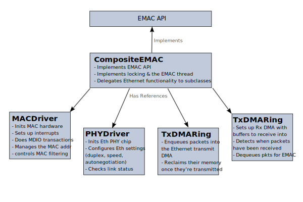
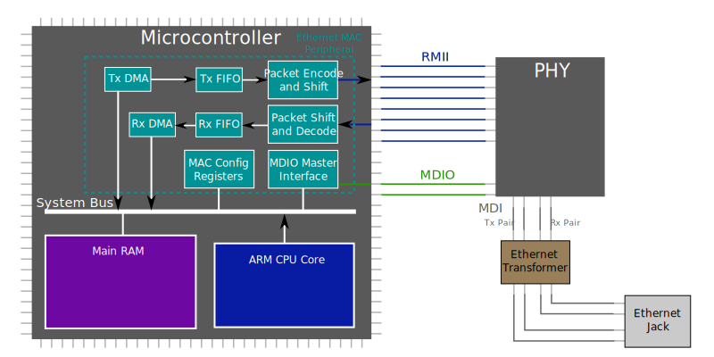
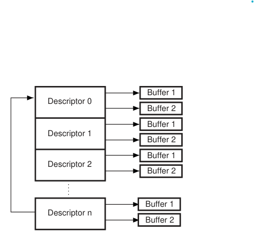

# Composite EMAC

The original Mbed OS EMAC API was added in Mbed OS 5.9. That API grouped all EMAC functionality into a single abstract class that targets/vendors had to implement, the `EMAC` class. Since then, dozens of Mbed targets have received EMAC drivers, and the strengths and weaknesses of this API have become clear. The general structure is good, and the idea of abstracting the memory manager and the network stack from the EMAC driver works well.

However, the [EMAC interface](https://github.com/mbed-ce/mbed-os/blob/0553c111850997d847dc6a3189ac0b7048304e57/connectivity/netsocket/include/netsocket/EMAC.h#L33) is difficult to implement, especially for people not intimately familiar with Mbed and its IP stacks. It requires EMAC implementations to implement the specifics of memory management, MAC address tracking, and DMA ring usage themselves, even though quite a bit of this logic is common to all MAC drivers. This has led to duplicated code, and quite often to half-assed code as well as chip vendors have struggled to conform to the (in some ways not very well defined) EMAC API. 

Couple that with inconsistent testing, and you have a recipe for inconsistent and buggy Ethernet drivers across the breadth of Mbed devices. For instance, Mbed supports zero-copy EMACs, where buffers can be passed directly to and from the Ethernet peripheral without being copied. This saves both memory and CPU time. However, this was only ever implemented for a few targets, because it's very difficult to get right. Even more egregiously, the EMAC driver implemented for STM32H7 for the past 6+ years has ignored the memory manager API and used LwIP directly, making it impossible to even test it with the EMAC tests (and hoo boy, were there a lot of things that would have failed). For extra fun, this driver also ignored the DMA functionality and sent packets _synchronously_, meaning the application is blocked while a packet is being transmitted!

To address this situation, Mbed CE is implementing a new layer in the EMAC driver stack: CompositeEMAC. CompositeEMAC is a class which implements the `EMAC` API and breaks up the functionality into several subclasses.

By implementing these four subclasses for each target MCU and board, high-performance Ethernet can be ported to any Mbed target much more easily than before.

## Embedded Ethernet - An Overview

Before we can get into the details of how CompositeEMAC works, we need to go over how embedded Ethernet works in general.

To run an ethernet connection, two chips need to work together*: the microcontroller and an external Ethernet PHY. The microcontroller sends and receives logic level Ethernet packets, while the PHY transforms those into Ethernet signals, which are decidedly *not* logic level (and actually have a lot in common with radio signals). The Ethernet signals, called MDI (Media Dependent Interface) pairs, are sent through an isolation transformer, which removes common mode interference and provides electrical isolation (e.g. so that the two ends of the connection can have different ground voltage levels).

The PHY and the MCU are connected via a standard called [Reduced Media Independent Interface](https://en.wikipedia.org/wiki/Media-independent_interface#RMII) (RMII), which transfers the Ethernet packets as serialized bytes. This is an 8-wire bus with a 50MHz clock, four receive lines, and three transmit lines. The clock is traditionally either supplied by the PHY or by a dedicated clock generator chip, though some MCUs support supplying this clock as well. In addition to RMII, there's also a two-wire command and control bus called [Management Data IO](https://en.wikipedia.org/wiki/Management_Data_Input/Output) (MDIO) (though it can also be referred to Station Management Interface (SMI) or even "MiiM"). MDIO is used for talking directly to the PHY, not for sending Ethernet packets. MDIO is an open-drain bus similar to I2C, but with 16-bit words instead of bytes and a specific frame format (referred to as "Clause 22"). Unlike RMII, MDIO is a multi-drop bus, so you can actually connect up to 15 PHYs or other devices to one set of MDIO lines as long as they have different addresses!

Inside the microcontroller, the bridge between the CPU and Ethernet is a peripheral called the Ethernet MAC. MAC stands for "Media Access Control" and refers to the second layer of the Ethernet protocol stack, the logic which encodes Ethernet packets and decides when to send them across the wire. The MAC has a number of moving parts inside. The simplest is the block of configuration registers, which is accessible at a specific memory address and sets up operation of the MAC (e.g. what MAC addresses the hardware should accept and which checksums should be inserted/checked by the MAC). There is also an MDIO master interface, which controls the MDIO lines to talk to the PHY.

Every Ethernet MAC I've seen also has DMA functionality. This means that the Ethernet peripheral can transmit and receive packets without direct CPU intervention. This is very important because it means your device can hit high network speeds without needing to have your CPU blocked for lots of time waiting on Ethernet packets to move through the hardware! For transmit, there will be a Tx DMA module which fetches data from the main RAM, and then enqueues the packet bytes plus control information into a FIFO (which is usually at least a couple thousand bytes long). Then, another block in the MAC, sometimes called the MTL (MAC Translation Layer) takes these bytes, applies any needed Ethernet framing, and shifts them out of the RMII Tx port.

For reception, the process works the same but in reverse: the decoder and shifter block takes in packets and enqueues their bytes into the Rx FIFO. Then, the Rx DMA dequeues the packets and stores them into RAM at the right location.

How does the DMA know where in RAM to read and write packets, though? On every embedded MAC I have seen so far, this is done through a ring of "DMA descriptors". Here's a diagram (that I stole from the STM32F2 datasheet):

A descriptor is a few-word-long structure in memory that contains control information and one or more pointers to memory buffers (which contain the actual packet data). For Tx, the DMA will fetch the descriptor, and then transmit the data in the buffers. For Rx, the DMA will fetch the descriptor, then write the packet to the descriptor's buffers. Either way, when done with the descriptor, the DMA will write status information (e.g. whether the checksum passed, or what timestamp the packet was sent at) back to the descriptor, set a flag, and then interrupt the CPU to tell it it has something to process.

But we don't want the DMA to have to wait for the CPU, do we? To avoid this, each descriptor also specifies a "next descriptor", either via an offset or a pointer. The DMA can move to this next descriptor and start processing it right away to send or receive the next packet. The CPU will process the completed descriptor on its own time and give it back to the DMA. In this manner, as long as your ring of descriptors is big enough and your CPU can keep up with processing them, the CPU and MAC never have to wait for each other!