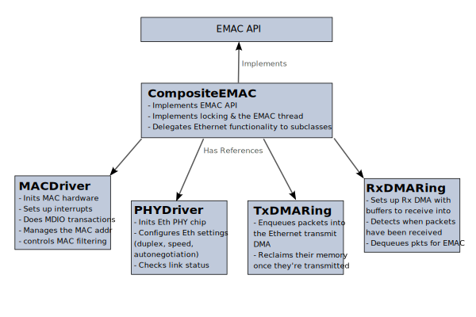

# Composite EMAC

The original Mbed OS EMAC API was added in Mbed OS 5.9. That API grouped all EMAC functionality into a single abstract class that targets/vendors had to implement, the `EMAC` class. Since then, dozens of Mbed targets have received EMAC drivers, and the strengths and weaknesses of this API have become clear. The general structure is good, and the idea of abstracting the memory manager and the network stack from the EMAC driver works well.

However, the EMAC interface is difficult to implement, especially for people not intimately familiar with Mbed and its IP stacks. It requires EMAC implementations to implement the specifics of memory management, MAC address tracking, and DMA ring usage themselves, even though quite a bit of this logic is common to all MAC drivers. This has led to duplicated code, and quite often to half-assed code as well as chip vendors have struggled to conform to the (in some ways not very well defined) EMAC API. 

Couple that with inconsistent testing, and you have a recipe for inconsistent and buggy Ethernet drivers across the breadth of Mbed devices. For instance, Mbed supports zero-copy EMACs, where buffers can be passed directly to and from the Ethernet peripheral without being copied. This saves both memory and CPU time. However, this was only ever implemented for a few targets, because it's very difficult to get right. Even more egregiously, the EMAC driver implemented for STM32H7 for the past 6+ years has ignored the memory manager API and used LwIP directly, making it impossible to test with the EMAC tests (and hoo boy, were there a lot of things that would have failed). For extra fun, this driver also ignored the DMA functionality and sent packets _synchronously_, meaning the application is blocked while a packet is being transmitted!

To address this situation, Mbed CE is implementing a new layer in the EMAC driver stack: CompositeEMAC. CompositeEMAC is a class which implements the `EMAC` API and breaks up the functionality into several subclasses.

